# UTS Pemrograman Berorientasi Objek
## Sistem Perhitungan Tagihan Air


**Nama:** Alya Aulia  
**NIM:** 2509116060  
**Kelas:** B  
**Mata Kuliah:** Pemrograman Berorientasi Objek  

---

## Deskripsi Proyek

**Sistem Perhitungan Tagihan Air** merupakan program berbasis **Command Line Interface (CLI)** yang dibuat menggunakan bahasa pemrograman Java.

Program ini digunakan untuk menghitung jumlah pemakaian air berdasarkan selisih antara meter awal dan meter akhir. Setelah jumlah pemakaian diketahui, sistem menghitung total tagihan berdasarkan golongan yang dipilih oleh pengguna.

Sistem memiliki dua golongan:

- **Hunian**, dengan tarif simulasi Rp3.000/m³.
- **Usaha**, dengan tarif simulasi Rp5.000/m³.

Tarif yang digunakan pada program ini merupakan tarif simulasi untuk kebutuhan UTS.

Rumus perhitungan:

```text
Pemakaian = Meter Akhir - Meter Awal

Total Tagihan = Pemakaian × Tarif Golongan
```

Program dibuat dengan menerapkan konsep dasar Pemrograman Berorientasi Objek, yaitu:

- Inheritance
- Polymorphism melalui Method Overriding
- Condition menggunakan If-Else
- Looping menggunakan Do-While

---

## Struktur Program

Program terdiri dari lima class:

```text
SistemTagihanAir
Golongan
Hunian
Usaha
Meter
```

Struktur inheritance:

```text
Golongan
├── Hunian
└── Usaha
```

Keterangan:

- `Golongan` merupakan superclass.
- `Hunian` merupakan subclass dari `Golongan`.
- `Usaha` merupakan subclass dari `Golongan`.
- `Meter` digunakan untuk menyimpan data meter dan menghitung jumlah pemakaian air.
- `SistemTagihanAir` merupakan class utama yang menjalankan menu dan proses program.

---

## Alur Program

Alur kerja program adalah sebagai berikut:

```text
Mulai
  ↓
Tampilkan Menu Utama
  ↓
Pilih Menu
  ↓
Jika memilih 1
  ↓
Input Nomor Meter
  ↓
Input Meter Awal
  ↓
Input Meter Akhir
  ↓
Validasi Nilai Meter
  ↓
Pilih Golongan
  ↓
Hunian / Usaha
  ↓
Hitung Pemakaian
  ↓
Hitung Total Tagihan
  ↓
Tampilkan Hasil
  ↓
Kembali ke Menu Utama
  ↓
Jika memilih 2
  ↓
Selesai
```

### Cara Menjalankan Program

1. Buka project `UTS_SistemTagihanAir` menggunakan NetBeans.
2. Jalankan file `SistemTagihanAir.java`.
3. Program akan menampilkan menu utama.
4. Pilih menu `1. Hitung Tagihan`.
5. Masukkan nomor meter.
6. Masukkan meter awal.
7. Masukkan meter akhir.
8. Pilih golongan:
   - `1` untuk Hunian.
   - `2` untuk Usaha.
9. Sistem menghitung jumlah pemakaian air.
10. Sistem menghitung total tagihan berdasarkan golongan yang dipilih.
11. Hasil perhitungan ditampilkan pada console.
12. Pilih menu `2. Keluar` untuk menghentikan program.

---

## Penerapan Inheritance

Inheritance diterapkan pada class `Golongan` sebagai superclass, kemudian class `Hunian` dan `Usaha` sebagai subclass.

### Class Hunian

```java
public class Hunian extends Golongan {

    public Hunian() {
        super("Hunian", 3000);
    }

    @Override
    public int hitungTagihan(int pemakaian) {
        return pemakaian * tarif;
    }
}
```

### Class Usaha

```java
public class Usaha extends Golongan {

    public Usaha() {
        super("Usaha", 5000);
    }

    @Override
    public int hitungTagihan(int pemakaian) {
        return pemakaian * tarif;
    }
}
```

Class `Hunian` dan `Usaha` menggunakan `extends Golongan`, sehingga keduanya mewarisi atribut dan method dari class `Golongan`.

Dengan demikian, ketentuan inheritance minimal dua tipe dipenuhi melalui:

```text
Golongan → Hunian
Golongan → Usaha
```

---

## Penerapan Polymorphism

Polymorphism diterapkan melalui **Method Overriding**.

Superclass `Golongan` memiliki method:

```java
public int hitungTagihan(int pemakaian) {
    return pemakaian * tarif;
}
```

Method tersebut dioverride pada class `Hunian` dan `Usaha`.

Pada program utama digunakan variabel:

```java
Golongan golongan;
```

Kemudian object ditentukan berdasarkan pilihan pengguna:

```java
if (pilihan == 1) {
    golongan = new Hunian();
} else if (pilihan == 2) {
    golongan = new Usaha();
}
```

Perhitungan dilakukan menggunakan:

```java
int total = golongan.hitungTagihan(pemakaian);
```

Walaupun variabel yang digunakan bertipe `Golongan`, method `hitungTagihan()` yang dijalankan mengikuti object yang dipilih, yaitu `Hunian` atau `Usaha`.

---

## Penerapan Condition

Condition digunakan untuk menentukan golongan yang dipilih pengguna.

```java
if (pilihan == 1) {
    golongan = new Hunian();
} else if (pilihan == 2) {
    golongan = new Usaha();
} else {
    System.out.println("Golongan tidak tersedia.");
    continue;
}
```

Jika pengguna memilih `1`, sistem menggunakan golongan Hunian.

Jika pengguna memilih `2`, sistem menggunakan golongan Usaha.

Jika pengguna memasukkan pilihan selain `1` atau `2`, program menampilkan pesan bahwa golongan tidak tersedia.

Condition juga digunakan untuk validasi meter:

```java
if (akhir < awal) {
    System.out.println("Meter akhir tidak boleh lebih kecil dari meter awal.");
    continue;
}
```

Validasi tersebut digunakan agar nilai meter akhir tidak lebih kecil dari meter awal.

---

## Penerapan Looping

Looping digunakan agar menu program dapat dijalankan berulang kali.

Program menggunakan perulangan `do-while`.

```java
do {
```

Perulangan berakhir dengan:

```java
} while (menu != 2);
```

Selama nilai menu tidak sama dengan `2`, program akan kembali menampilkan menu utama.

Program berhenti ketika pengguna memilih menu:

```text
2. Keluar
```

---

## Penjelasan Gambar dan Hasil Pengujian

### 1. Struktur Project

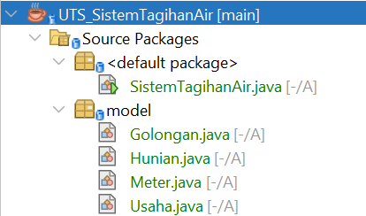

Gambar di atas menunjukkan struktur project pada NetBeans. Program terdiri dari class `SistemTagihanAir`, `Golongan`, `Hunian`, `Usaha`, dan `Meter`.

---

### 2. Inheritance pada Class Hunian

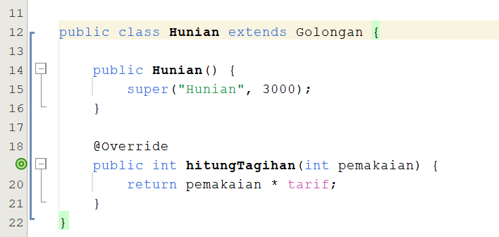

Gambar di atas menunjukkan bahwa class `Hunian` menggunakan `extends Golongan`. Hal tersebut menunjukkan penerapan inheritance dari superclass `Golongan` ke subclass `Hunian`.

---

### 3. Inheritance pada Class Usaha

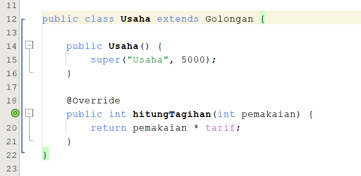

Gambar di atas menunjukkan bahwa class `Usaha` juga menggunakan `extends Golongan`. Class `Usaha` menjadi tipe turunan kedua dari class `Golongan`.

---

### 4. Method Overriding pada Class Hunian

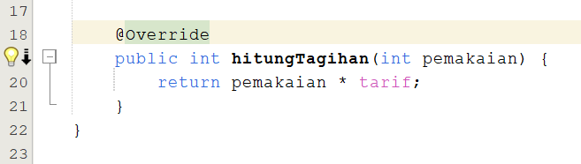

Gambar di atas menunjukkan penggunaan `@Override` pada method `hitungTagihan()` di class `Hunian`. Method tersebut merupakan penerapan polymorphism melalui method overriding.

---

### 5. Method Overriding pada Class Usaha

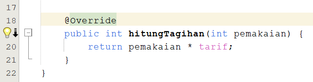

Gambar di atas menunjukkan penggunaan `@Override` pada method `hitungTagihan()` di class `Usaha`.

---

### 6. Condition If-Else

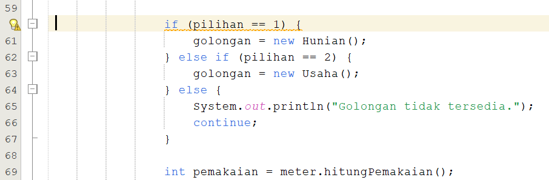

Gambar di atas menunjukkan penggunaan `if-else` untuk menentukan golongan yang dipilih pengguna.

---

### 7. Looping Do-While

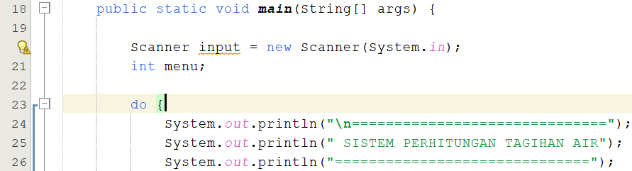

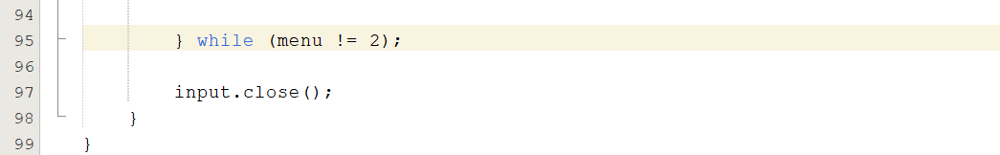

Gambar di atas menunjukkan penggunaan perulangan `do-while` agar menu utama dapat terus dijalankan sampai pengguna memilih menu keluar.

---

## Screenshot Output Program

### Pengujian Golongan Hunian

Data yang digunakan:

```text
Nomor Meter : M1
Meter Awal  : 100
Meter Akhir : 115
Golongan    : Hunian
```

Perhitungan:

```text
Pemakaian = 115 - 100
Pemakaian = 15 m³

Total = 15 × Rp3.000
Total = Rp45.000
```

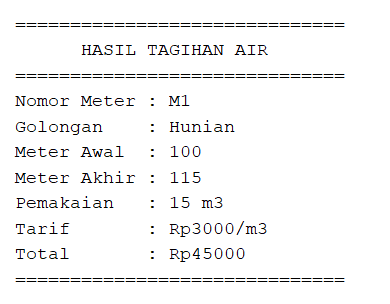

Gambar di atas menunjukkan bahwa sistem berhasil menghitung pemakaian air sebesar **15 m³** dan menghasilkan total tagihan sebesar **Rp45.000** untuk golongan Hunian.

---

### Pengujian Golongan Usaha

Data yang digunakan:

```text
Nomor Meter : M2
Meter Awal  : 200
Meter Akhir : 220
Golongan    : Usaha
```

Perhitungan:

```text
Pemakaian = 220 - 200
Pemakaian = 20 m³

Total = 20 × Rp5.000
Total = Rp100.000
```

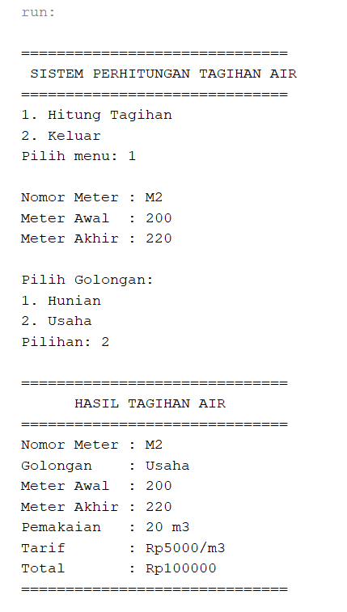

Gambar di atas menunjukkan bahwa sistem berhasil menghitung pemakaian air sebesar **20 m³** dan menghasilkan total tagihan sebesar **Rp100.000** untuk golongan Usaha.

---

### Pengujian Validasi Meter

Data yang digunakan:

```text
Nomor Meter : M3
Meter Awal  : 150
Meter Akhir : 120
```

Karena meter akhir lebih kecil dari meter awal, program menampilkan pesan:

```text
Meter akhir tidak boleh lebih kecil dari meter awal.
```

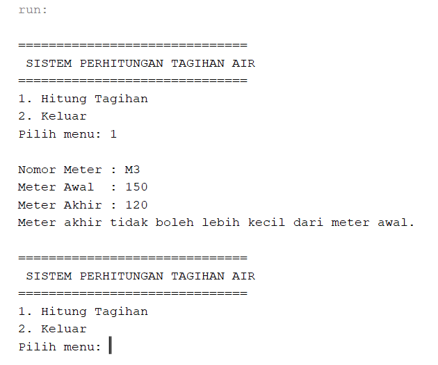

Gambar di atas menunjukkan bahwa program berhasil melakukan validasi ketika nilai meter akhir lebih kecil dari meter awal.

---


## Kesimpulan

Sistem Perhitungan Tagihan Air merupakan program Java berbasis Command Line Interface yang digunakan untuk menghitung jumlah pemakaian dan total tagihan air berdasarkan golongan pengguna.

Program menggunakan `Golongan` sebagai superclass serta `Hunian` dan `Usaha` sebagai subclass. Polymorphism diterapkan melalui method overriding `hitungTagihan()` pada class `Hunian` dan `Usaha`.

Condition digunakan untuk menentukan golongan dan melakukan validasi meter, sedangkan looping digunakan agar menu program dapat dijalankan berulang kali sampai pengguna memilih keluar.

Berdasarkan hasil pengujian, program dapat menghitung tagihan untuk golongan Hunian dan Usaha serta dapat menangani kondisi ketika nilai meter akhir lebih kecil dari meter awal.
